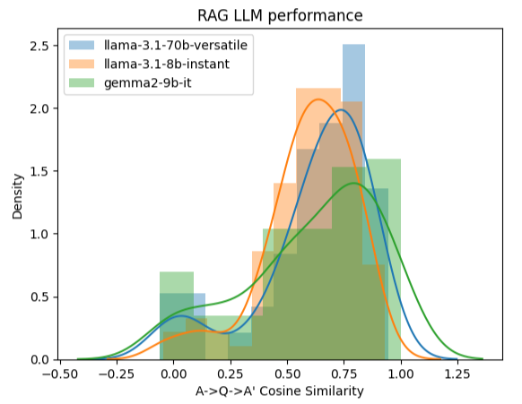

# Ask My Resume

This interactive Q&A app that lets you query your resume using LLMs and vector search. It uses a a retrieval-augmented generation (RAG) pipeline to deliver contextual and grounded answers. Use this AI career assistant to ask questions about your resume like:
- *“What projects show my data science skills?”*
- *“How well does my experience match this job description?”*
- *“Summarize my strengths for a software engineering role.”*

### Tech Stack:
- **Vector DB**: Qdrant (served via Docker)
- **Embedding**: FastEmbed
- **LLM**: Groq API (OpenAI-compatible API)   
- **UI**: Streamlit

### Interface Overview:

<p align="center">
  
</p>

<!---->

Key features include:
- A **sidebar** to:
  - Select the LLM model to use (
  - Filter which resume sections to search (e.g., Projects, Skills, Education)
  - Adjust the number of context chunks retrieved

- A **chat interface** where you can:
  - Ask the LLM questions about your resume
  - View the **source citations** under each response
  - Rate each answer with a 👍 / 👎 feedback
    
## Setup Instructions

### 1. Clone the repo
```bash
git clone https://github.com/nmkhan096/ask-my-resume.git
cd ask-my-resume
```
### 2. Install dependencies
```
python -m venv .venv
source .venv/bin/activate  # On Windows: .venv\Scripts\activate
pip install -r requirements.txt
```
### 3. Add .env file
```
# .env
GROQ_API_KEY=your_api_key
```

### 4. Run Qdrant with Docker
To run a Qdrant instance in a Docker container, first pull the image and start the container:
```
docker pull qdrant/qdrant

docker run -p 6333:6333 -p 6334:6334 \
   -v "$(pwd)/qdrant_storage:/qdrant/storage:z" \
   qdrant/qdrant
```

###  5. Parse your resume
Add your resume (`.docx` file) to the `data/` folder and run the parser script.

- from CLI:
```
python rag_pipeline/parser.py "data/Resume.docx" \
    --sections "Work Experience" "Projects" "Education" "Skills" \
    --output "data/resume_chunks.json"
```
- in a notebook / script:
```
from rag_pipeline.parser import parse_resume_to_chunks

chunks = parse_resume_to_chunks("data/Resume.docx", ["Work Experience", "Projects"])
```

###  6. Load vectors into Qdrant
run `qdrant_setup.py` only ONCE to ingest data:
- CLI
```
python rag_pipeline/qdrant_setup.py \
  --input data/resume_chunks.json
```
- notebook:
```
from rag_pipeline import qdrant_setup
qdrant_setup.setup_collection()
qdrant_setup.ingest_documents(docs)
qdrant_setup.create_section_index()
```

### 7. Run the Streamlit app
- CLI
```
streamlit run app.py
```

- notebook:
```
from rag_pipeline.rag import *

print(rag("Summarise the key strengths"))
```
## Evaluation

Evaluating a Retrieval-Augmented Generation (RAG) system requires assessing both retrieval quality and generation quality, hence it's a two-step pipeline:

1. **Retrieval Evaluation**: *How good is the context you retrieve?* --> evaluates how relevant the retrieved documents are to the question.
2. **Generation Evaluation**: *How good are the answers?* --> evaluates the generated answer based on the retrieved context.

> See evaluation/rag_evaluation.ipynb for details.

### 1. Retrieval Evaluation

To assess the quality of vector-based retrieval, I used the following metrics based on the ground-truth dataset for each question:

- **Hit@K**: indicates whether the correct chunk appeared within the top-K retrieved results.
- **MRR@5** (Mean Reciprocal Rank): reflects how high on average the correct chunk was ranked within the top k.

> Metrics like Recall@k and Hit@k focus on **Retrieval accuracy** to assess whether the right chunk was in the top-k set. High retrieval accuracy ensures the LLM is grounded in the correct context, minimizing hallucinations.

> MRR focuses on **Ranking quality** to assess whether the most relevant doc ranked high enough to influence the LLM. A higher value improves answer quality.

The results demonstrate strong retrieval performance, particularly within the top 3-5 chunks:

| Metric | Score |
| --- | --- |
| Hit@1 | 0.60 |
| Hit@3 | 0.789 |
| Hit@5 | 0.810 |
| MRR@5 | 0.691 |

### 2. RAG Evaluation (LLM Response Quality)

I compared multiple LLMs on their ability to answer resume-based questions with accuracy and grounding using two approaches:

1. **Cosine Similarity**
Embeddings (via `sentence-transformers`) were compared between the ground-truth answer (A) and the model-generated answer (A') using cosine similarity. Below is the distribution across models: 

<p align="center">
  
</p>

<!---->

1. **LLM-as-a-Judge** (GPT-4o mini)
To evaluate the quality of generated answers, I used a second LLM (`gpt-4o-mini`) as a judge, rating a handful of responses on their correctness and groundedness, from 0 to 2:

Over 74% of responses were rated as fully correct.

| Score | Meaning | Count |
| --- | --- | --- |
| 2 | correct & grounded | 70 |
| 1 | either correct OR grounded | 18 |
| 0 | Incorrect & not grounded | 7 |

Correctness tells us if the answer is useful and appropriate **given the question**, whereas Groundedness tell us if the answer is **based entirely on the retrieved context** (i.e., the resume)

> High correctness but low groundedness = RAG system is **hallucinating** or fabricating

> High groundedness but low correctness = bad reasoning or mismatch, RAG is **misunderstanding** the retrieved context

### Summary

- **Recommendation**: Use the `llama-3.3-70b-versatile` variant for accuracy-critical resume Q&A applications with 3-5 chunks limit.
